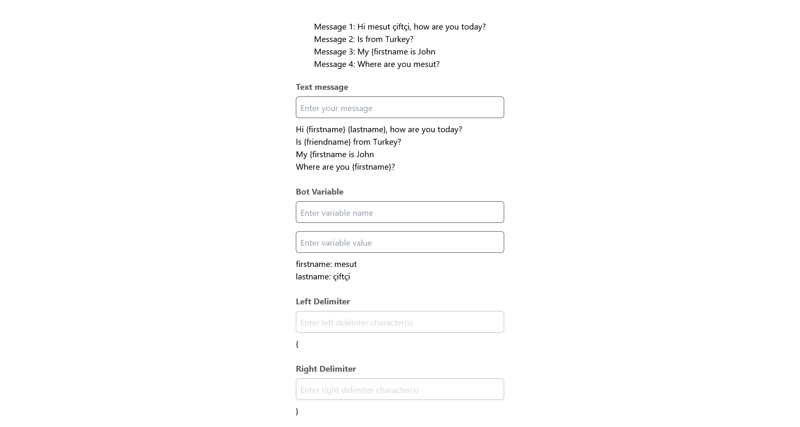

# Chatbot tester

[Live Preview](https://chatbot-tester.vercel.app/)

## What does this project do?

When a user talks to a chatbot, they might leave some interesting data like their name, age, birth place or favourite color.
This information can be stored in the chat **Session** - an object that represents the state of the chat conversation. Using the session, bot builders can direct the flow of the conversation, make dynamic API calls or even use those session variables inside the conversation.

A bot builder could use the variables stored in the session in the messages a bot sends, for example in the following Text Message:
Given a session object:

```json
{
  "firstname": "John"
}
```

The bot will fill in the variable in the text message, resulting in the message:

> Hi! I'm Choo Choo, but your name is way cooler, isn't it, John

If the variable does not exist within the session, the template will be replaced with an empty string.

## How to run?

### `npm install`

### `npm run dev`

### `npm test`

After run project find local url from your command prompt where you write "npm run dev" command and visit the link

The page will reload if you make edits.\
You will also see any lint errors in the console.

## Screenshots


